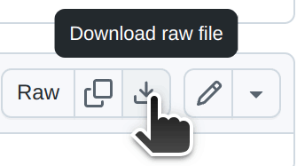

# BOOLOG

**Rich Logging System**

Boolog allows your Rust program to log directly to an HTML file, with optional counterpart logging to the console. This will help developers and managers alike better
visualize what goes on with back-end processes, such as a cloud service or a test suite against REST API calls.
(Boolog is the "spiritual" successor of an automated test logger project created at one of the author's previous places of employment.)

### To install for use in your project
### `TBD`
---
## Example Code
For usage, refer to this example program and Go Doc comments.

[Example Program](src/lib.rs) (Scroll down and look for `fn it_works()` in the `tests` module.)

## Supported Themes

[Themes Poster (GIF)](examples/Poster.gif)

GitHub won't let me directly link to the HTML examples showing each theme (it forces it to resolve as HTML source code).
Instead, I've bundled the examples into a ZIP archive that you can preview on your computer.

To get the archive, click [here](examples/Theme-Examples.zip) and then click the "Download Raw File" icon at right.

---
## MIT License
Copyright (c) 2025 William Arthur Hood

Permission is hereby granted, free of charge, to any person obtaining a copy
of this software and associated documentation files (the "Software"), to deal
in the Software without restriction, including without limitation the rights to
use, copy, modify, merge, publish, distribute, sublicense, and/or sell copies
of the Software, and to permit persons to whom the Software is furnished
to do so, subject to the following conditions:

The above copyright notice and this permission notice shall be included
in all copies or substantial portions of the Software.

THE SOFTWARE IS PROVIDED "AS IS", WITHOUT WARRANTY OF ANY KIND,
EXPRESS OR IMPLIED, INCLUDING BUT NOT LIMITED TO THE WARRANTIES
OF MERCHANTABILITY, FITNESS FOR A PARTICULAR PURPOSE AND
NONINFRINGEMENT. IN NO EVENT SHALL THE AUTHORS OR COPYRIGHT
HOLDERS BE LIABLE FOR ANY CLAIM, DAMAGES OR OTHER LIABILITY,
WHETHER IN AN ACTION OF CONTRACT, TORT OR OTHERWISE, ARISING
FROM, OUT OF OR IN CONNECTION WITH THE SOFTWARE OR THE USE OR
OTHER DEALINGS IN THE SOFTWARE.